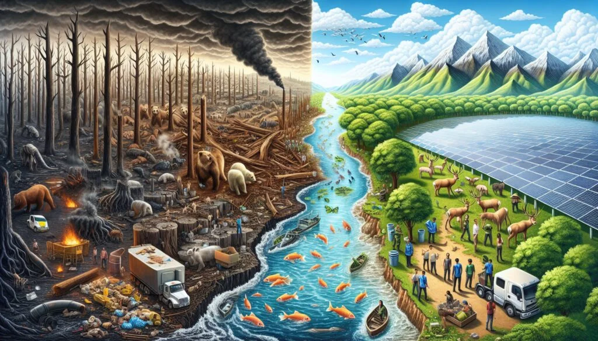

# 🌍 *Retos Ambientales y Sociales*

_Un trabajo sobre Retos Ambientales y Sociales_

---

## 📑 Índice

### 1. [Introducción](introduccion.md)
### 2. [Principales retos ambientales y sociales](principales_retos.md)
### 3. [Impacto de los actuales problemas medioambientales](impactos.md)
### 4. [Medidas y acciones para minimizar los impactos ambientales](medidas_y_acciones.md)

---

## 📑 Conclusiones [Ver](conclusiones.md)

## 🧷 Mapa conceptual [Ver](mapa_conceptual.md)

## 📘 Glosario [Ver](glosario.md)

## 📖 Referencias [Ver](referencias.md)

## ✍️ Autores [Ver](autores.md)

