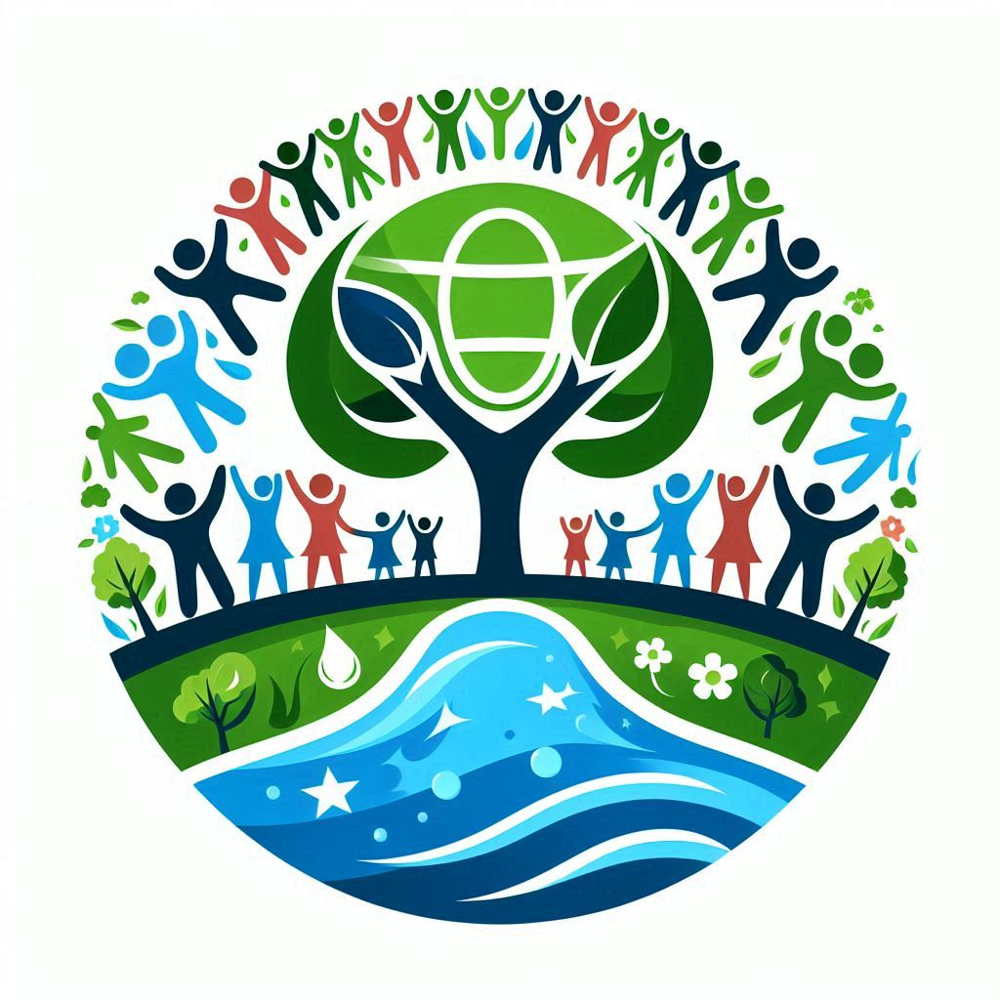

## 📑 Conclusiones

Es importante destacar la importancia y el impacto que tenemos nosotros, los seres humanos, en mantener el planeta en perfectas condiciones no sólo para nosotros, si no también para los que vienen en un futuro. 

Cerrar bien los grifos, reciclar, usar luces de bajo consumo, usar transporte público, etc. son acciones diarias que mejoran dia a dia nuestro planeta y ayuda a mantanerlo "limpio".

Inculcar en las industrias de cualquier sector, pautas a seguir para la reducción de contaminación ya que son uno de los focos más importantes que más contamina y de manera exponencial.

Respecto a los retos sociales, debemos de erradicar la pobreza y ayudar siempre al pueblo, para que los derechos básicos no le falte a nadie como la asistencia sanitaria o la educación.

